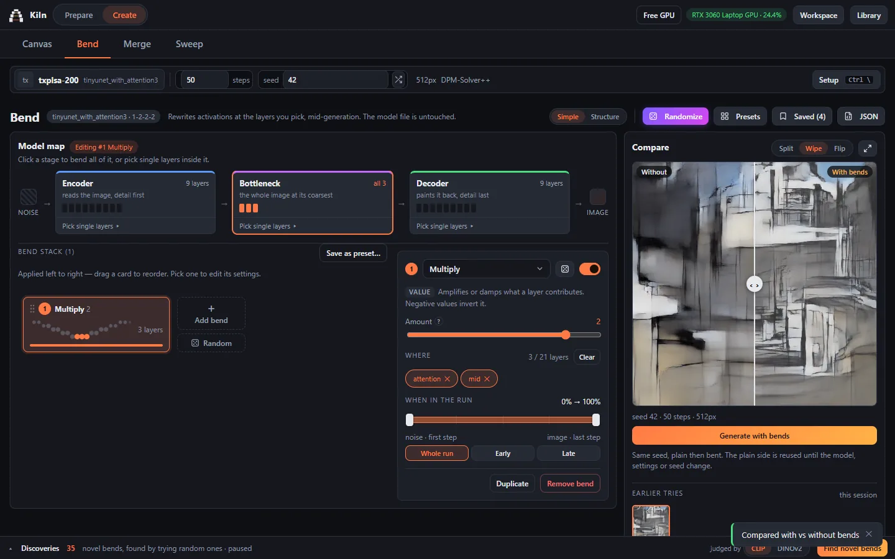
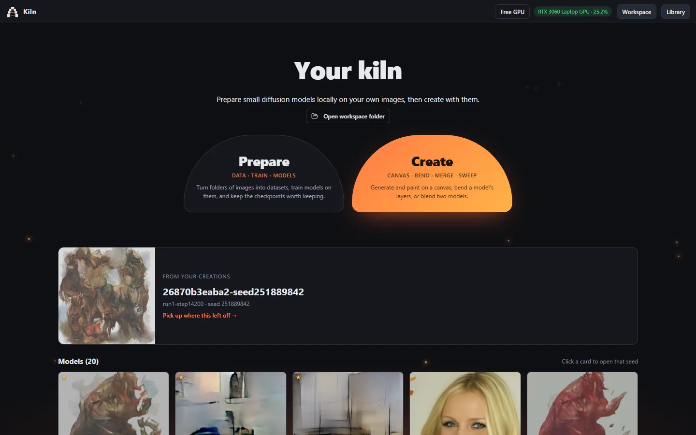
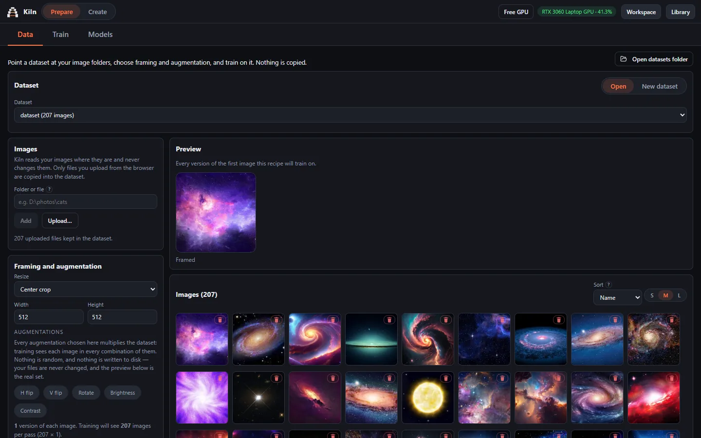
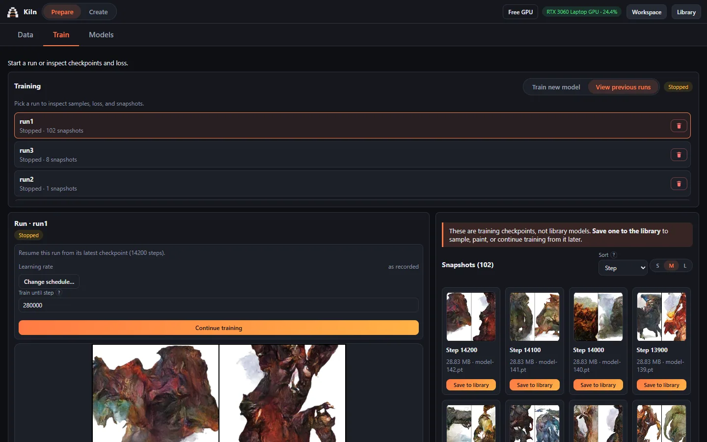
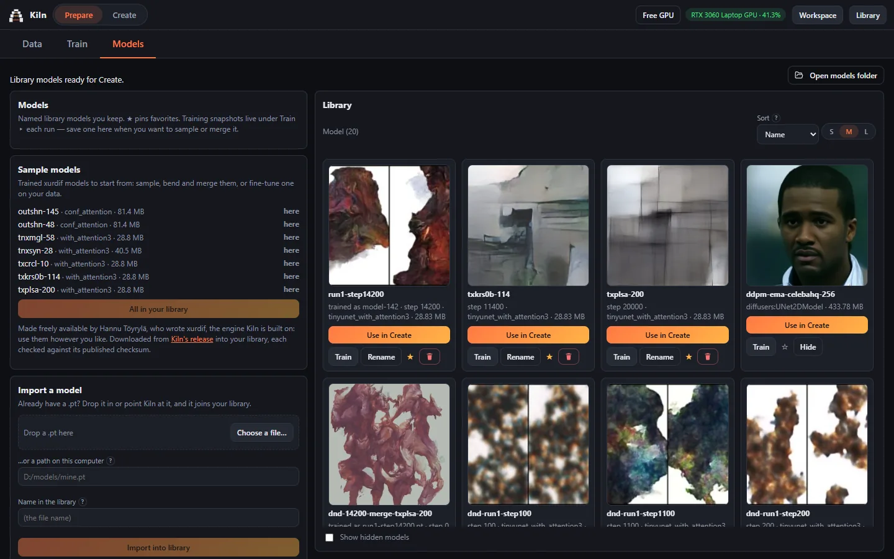
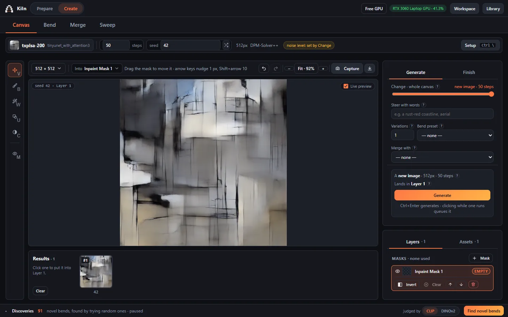
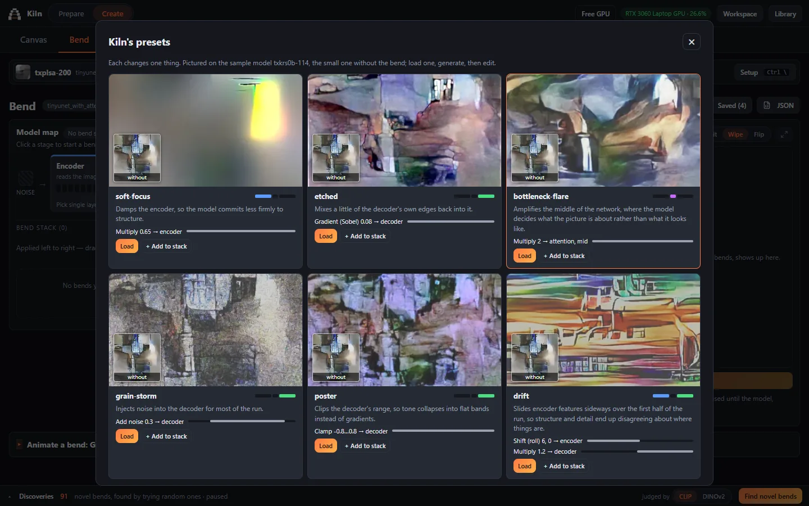
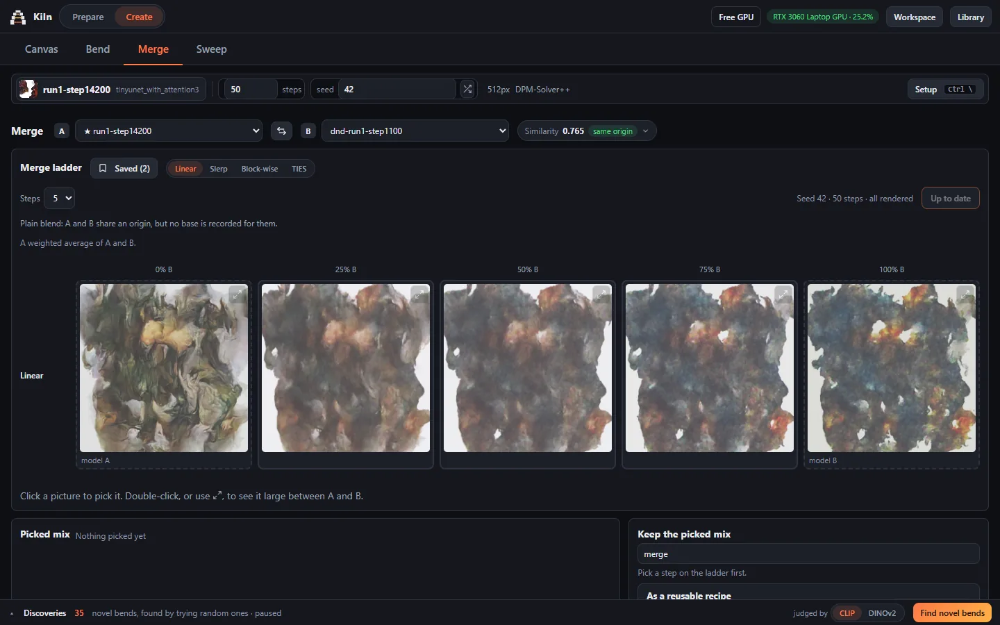
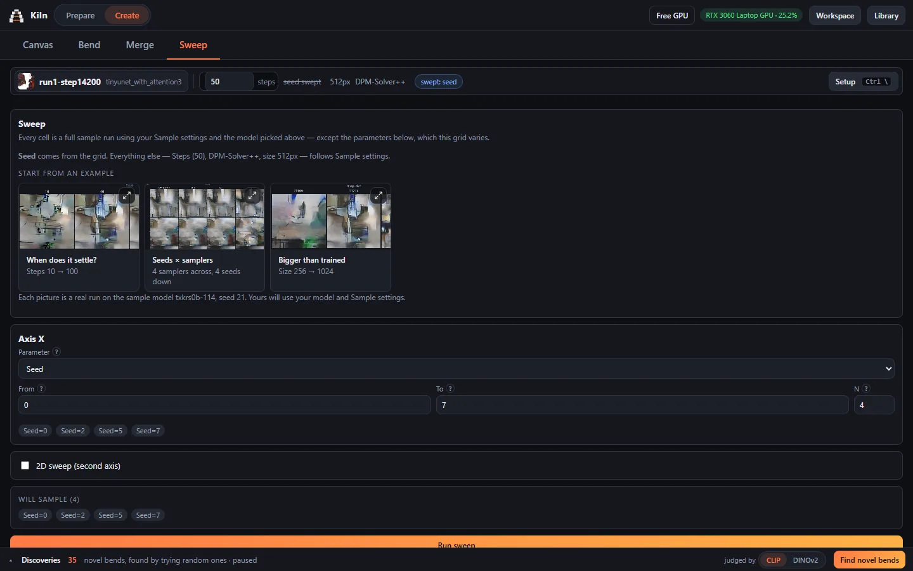

<p align="center"></p>

<h1 align="center">Kiln</h1>

<p align="center"><b>Train small diffusion models on your own pictures, then take them apart and play.</b></p>

Kiln is a desktop app for artists and the curious. Give it a folder of a few hundred images and it
trains a compact image model on them, on your own computer. Then you make pictures with that
model, and go further than "generate": paint into them, *bend* the network while it works, blend
two models into a third, and lay a setting out across a grid to see what it does.

Nothing leaves your machine. Your images, models and pictures stay in one folder you can open.



Kiln has two halves, and the usual path runs from one to the other:

* **Prepare**: collect images into a **dataset**, **train** a model on it, and keep the good ones
  in your **model library**.
* **Create**: generate and paint on a **canvas**, **bend** a model's layers, **merge** two
  models, and **sweep** a setting across a grid.

No dataset yet? Kiln can fetch seven ready-made sample models in one click, so you can start in
Create on day one. It is inspired by [Autolume](https://metacreation-lab.github.io/autolume/).

---

## Quick start

1. **Get Kiln.** Clone this repository, or download it as a zip and unpack it.
2. **Start it.** Double-click `kiln.bat` on Windows, `kiln.command` on macOS, or run `./kiln.sh`
   on Linux. The first run installs everything into a private folder (`.venv`), which takes a
   while: PyTorch for your GPU alone is about 2.5 GB. Later runs start in seconds.
3. **Get a model.** Open **Prepare ▸ Models ▸ Sample models ▸ Get all**, then go to **Create** and
   press **Generate**.

On Windows and Linux the first run also adds **Kiln** to the Start menu (and the desktop) or the
application menu, with Kiln's icon. Use that from then on. Opening Kiln while it is already
running brings up another window on the same session rather than starting a second one.

You need **Python 3.10 or newer**. On Windows, if Kiln cannot find it, it offers to install
Python 3.12 for you with `winget`. Details for each system are under [Install](#install).

---

## A tour

### Start



The hub you land on. **Prepare** and **Create** lead into the two halves, and a bar shows any job
running in either. Your latest capture is there to pick up where you left off. Every model in
your library appears as a card that cycles through pictures Kiln made with it in the
background. Click one to open it in Create at that picture's seed.

### Prepare ▸ Data: a folder becomes a dataset



A dataset is Kiln's record of images you already have, not a copy of them.

* **Add a folder or file** by path and it is read where it lives, subfolders included. New files
  dropped into that folder join the dataset on their own. **Upload…** is the one exception: files
  sent from the browser are copied in, since they have nowhere else to live.
* **Videos** are turned into frames on request, at a rate you choose.
* **Remove** an image and it leaves the dataset but stays on disk; "Show removed" and **Restore
  all** undo it. Removing a source folder never touches the folder.
* **Framing and augmentation** decide what training sees:
  * a size, and how images are fitted to it: center crop, stretch, or pad;
  * which augmentations to use: H flip, V flip, Rotate, Brightness, Contrast.

  The augmentations combine, so the recipe says exactly how big the training set is: *H flip ×2 ·
  Rotate ×4 = 8 versions of each image.* Nothing is random, and no augmented copies are written to
  disk.
* **Train on this dataset** carries it straight to a new run.

### Prepare ▸ Train: teach a model



**Train new model** sets up a run: a dataset, a name, and whether to start from scratch or from a
model in your library.

* **Presets** suit the run to your GPU, and Kiln estimates peak memory before you start.
* **Under Advanced:** image size, batch, learning rate, architecture, attention layout and
  snapshot frequency.
* **While a run goes:** live samples, a loss curve, the exact command in use, and the log.
* **Stop and continue:** a run can be stopped and continued later from its latest checkpoint.
* **Snapshots** are checkpoints along the way. **Save** the ones you like into the library under a
  name.

**View previous runs** lists everything you have trained.

### Prepare ▸ Models: your library



Your library, plus five ways to add to it:

* **Sample models**: seven models to start from, fetched in one click (see
  [Getting models](#getting-models)).
* **Import a model**: a `.pt` you already have. Drop it in, or give its path.
* **Get a model**: download a checkpoint from a URL.
* **Re-home a model**: convert a xurdif `.pt` into the Diffusers format, leaving the original
  alone.
* **From Hugging Face**: check a repo for compatibility and import it. Unconditional pixel-space
  models only; text-to-image models such as Stable Diffusion are not supported.

Model cards show a sample, the architecture and training step, and offer **Use in Create**,
**Train**, rename and pin. Models inside Kiln's folder can be deleted. Models Kiln only found
elsewhere are hidden instead, and the file stays where it is.

### Create ▸ Canvas: make and paint



Pick a model, set steps and seed, and generate. The picture builds up step by step, and you can
pause or stop it and keep it as it is.

* **Change** sets how far a generation moves away from what is already on the canvas. Turned down,
  it reworks the picture you have instead of starting over.
* **Masks** limit a generation to one region. Paint them, draw them as shapes, grow them with a
  wand, split them from the image itself, or generate them as patterns. Feathering and a harmonize
  pass settle the seam.
* **Steer with words** nudges sampling towards a text prompt, or towards a reference image,
  through CLIP.
* **Finish** applies contrast, gamma and sharpening, and upscales.
* **Layers, assets and a results history** sit alongside the canvas. Any result can become a layer
  or be saved.
* **Recipes travel with the picture:** saved PNGs carry their settings inside them, so opening one
  later restores the run.

Shortcuts: `Ctrl+Z` / `Ctrl+Shift+Z` undo and redo, `Ctrl+D` clears the mask, `Ctrl+Shift+I`
inverts it, and space-drag pans the canvas.

### Create ▸ Bend: reach inside the model



Bending rewrites the network's activations while a picture forms. It changes the output, never
the model file.

* **Pick where:** choose layers on a map of the model.
* **Stack operations:** multiply, shift, add noise, clamp, and more. Each has its own amount and a
  window of the run to act in.
* **Compare:** see the bent picture against the plain one on the same seed (the picture at the top
  of this page).
* **Start from a preset:** the six starters show what each kind of bend does.
* **Keep and share:** setups save as presets and export as JSON.
* **Animate:** sweep one bend setting into a GIF or video loop.

### Create ▸ Merge: blend two models



Blend two compatible models: linear, slerp, per block, or from a shared base (TIES and task
arithmetic).

* **The ladder:** Kiln samples both parents and the blends between them on the same seed, so you
  pick a ratio by looking at the whole range. Zoom in between two steps and fine-tune the pick.
* **Models trained apart** are lined up (re-basin) before blending. A similarity score says how
  related the two are.
* **Keep the result** as a new library model, or as a *recipe*: just the mix and the two models,
  without a model file.
* **Merge with**, on the Canvas, blends a recipe into the selected model in memory, for the whole
  canvas or one mask.

### Create ▸ Sweep: see what a setting does



Lay a setting out across a grid, one axis or two: seed, steps, sampler or image size. Kiln
samples every cell, and you can download the contact sheet. Three worked examples are one click
away.

### Discoveries

A strip along the bottom of Create runs a background explorer. Given a model, it tries random bends
and keeps the ones that look new to it, judged by CLIP or DINOv2. It yields to your own
generations. Any discovery can be loaded into Bend, saved as a preset, or opened in a map that
walks between similar results.

---

## Driving Kiln from code

Everything the window does goes through a local HTTP API, so a script, a notebook or an AI agent
can use Kiln too. Start Kiln as usual, or headless with `--no-window`, and send requests to
`http://127.0.0.1:8777/api`.

Every reply has the form `{"ok": true, "data": …}`, or `{"ok": false, "error": "…"}` with an HTTP
error status. Anything that takes GPU time is a **job**: the request returns at once with a job
id, and you poll that until it is done.

This makes one bent picture and keeps it. It needs `requests`, which Kiln's own `.venv` already
has:

```python
import base64, time
import requests

KILN = "http://127.0.0.1:8777/api"

def call(method, path, **kw):
    r = requests.request(method, KILN + path, **kw).json()
    if not r.get("ok"):
        raise RuntimeError(r.get("error"))
    return r.get("data")

# 1. Pick a model from the library. Models are named by their path.
models = call("GET", "/models")
model = next(m["path"] for m in models if m["name"] == "txplsa-200")

# 2. A starter bend from Kiln's presets.
flare = next(p for p in call("GET", "/craft/bends") if p["name"] == "starter-bottleneck-flare")

# 3. Queue a generation: a job comes back straight away.
job = call("POST", "/perform/sample", json={
    "model_path": model, "seed": 42, "steps": 50,
    "bends": flare["bends"],
})["job"]

# 4. Poll it until it is done.
while job["status"] not in ("done", "error", "cancelled"):
    time.sleep(0.5)
    job = call("GET", f"/jobs/{job['id']}")
    print(f"{job['progress']:.0%}  {job['message']}", end="\r")

# 5. The picture comes back as a data URL, and its recipe as a card.
image = job["detail"]["frame"]
open("bent.png", "wb").write(base64.b64decode(image.split(",", 1)[1]))

# Or keep it in Kiln's captures, recipe embedded, like the Capture button.
saved = call("POST", "/perform/capture", json={"image": image, "card": job["detail"]["card"]})
print("\nsaved to", saved["path"])
```

Jobs you start this way show up in the open window as well, so you can watch them.

| To | Call |
| --- | --- |
| List models | `GET /models` — each has a `name` and a `path`; send the path as `model_path` |
| Generate | `POST /perform/sample` with `model_path`, plus any of `seed`, `steps`, `image_size`, `variations` (1–4), `text` (steer with words), `init_image` + `noise_level` (rework a picture), `bends`, `merge` |
| Follow a job | `GET /jobs/<id>` → `status`, `progress`, `message`, `detail`; `POST /jobs/<id>/cancel`, `/pause`, `/resume` |
| Save a picture | `POST /perform/capture` with `image` and `card` |
| Bends | `GET /craft/bends` (starters and your presets), `GET /craft/ops` (what each operation takes), `POST /craft/introspect` with `model_path` (the layers you can target) |
| Sweep | `POST /tools/sweep` with `model_path`, `param`, `from`, `to`, `count` — a job; the contact sheet is in `detail.sheet` |
| Merge | `POST /craft/merge` with `model_a`, `model_b`, `out_name`, `method`, `alpha` — writes a new model and returns its path |
| Datasets | `POST /datasets` with `name`, then `POST /datasets/<name>/link` with a folder `path` |
| Train | `POST /train` with `dataset`, `run_name` — a job; stop it with `/jobs/<id>/cancel` |

The routes live in [`app/backend/routes/`](app/backend/routes), one file per area. The scripts in
[`scripts/`](scripts) exercise most of them, and are good worked examples.

Kiln has no login. The API can read and write everything in your Kiln folder, which is why it
listens only to this computer unless you start it with `--lan`.

---

## Getting models

The repository ships no weights. Five ways to get some:

1. **The sample models.** Seven xurdif checkpoints trained by Hannu Töyrylä, who wrote xurdif. He
   has made them freely available: use, change and share them however you like.
   **Prepare ▸ Models ▸ Sample models ▸ Get all** fetches them (319 MB) from the
   [`sample-models-v1` release](https://github.com/abuzreq/kiln/releases/tag/sample-models-v1)
   into your library, checking each against its pinned SHA-256.
2. **A model you already have.** Drop the `.pt` onto **Prepare ▸ Models ▸ Import a model**, or
   give it the path. Kiln copies it into `~/kiln/models` (or `$KILN_WORKSPACE/models`). That is
   where Kiln keeps models, and the only folder you need to know about. Putting files there
   yourself works too; **Open models folder** on the Models page opens it. Each model's name card
   and thumbnail are kept in a hidden `.kiln` folder inside it, so the folder itself shows only the
   models.
3. **More xurdif checkpoints** from the [author's Dropbox folder](https://www.dropbox.com/scl/fo/flh4pczukrrlb3ar1rfuc/AAT22M2b21Tf1yKe3Ji0HS0?rlkey=f1zdhexy36p3hffcun686m77c&dl=0),
   loaded under **Prepare ▸ Models ▸ Get a model**.
4. **Hugging Face**, under **Prepare ▸ Models ▸ From Hugging Face**.
5. **Train your own**, which is what the rest of Prepare is for.

Older installs kept models in the install's own `models/pretrained` and `models/fine_tuned`. Kiln
no longer ships those folders, but if yours still has them it scans them, and a recipe naming a
model there finds the same file once it has been moved into the workspace. Kiln will only ever
hide a model outside the workspace, never delete it. A file Kiln finds but cannot read is listed
under **Not loading** with the reason, instead of quietly not appearing.

---

## Install

### Requirements

* **Python 3.10+.** On Windows, `kiln.bat` offers to install it through `winget` if none is found.
* **A GPU:** an NVIDIA card with CUDA, or a Mac with Apple Silicon (see [macOS](#macos)).
  Training xurdif models needs NVIDIA. Diffusers models train on either GPU, or slowly on the CPU.
* **About 6 GB of disk** for PyTorch and the rest of the dependencies.
* **Internet on first use of some features.** Steering with words downloads OpenAI's CLIP weights
  (about 350 MB), and the DINOv2 novelty measure downloads Meta's model (about 350 MB), each
  once. Models from Hugging Face and the sample models download when you ask for them.
  Third-party models carry their own licences.
* **Node.js 18+** only if you want to change the interface. The built UI ships in
  `app/frontend/build`.

| | NVIDIA GPU (Windows, Linux) | Apple Silicon Mac | CPU only |
| --- | --- | --- | --- |
| **Sampling, painting, bending, merging** | Yes | Yes | Yes, slowly |
| **Training xurdif models** | Yes | No — the xurdif trainer needs CUDA | No |
| **Training and fine-tuning Diffusers models** | Yes | Yes | Yes, very slowly (not on Intel Macs) |

### Launchers, shortcuts and the network

`kiln.bat`, `kiln.command` and `./kiln.sh` build the virtual environment on first run and start
the app. After the first successful install, Kiln adds a **Kiln** shortcut to the Start menu and
the desktop on Windows, or an application-menu entry on Linux. It does this once, so a shortcut
you delete stays deleted. To make them again, for example after moving the Kiln folder, run:

```bash
python install.py --shortcuts
```

macOS gets no shortcut: a `.command` file cannot carry an icon without an app bundle around it.

To reach Kiln from another machine on the same network, use `start_lan.bat`, `start_lan.command`
or `./start_lan.sh` instead; each prints the address to open. Kiln has no login, so anyone who can
reach that address can browse your datasets, models and files. Only do this on a network you
trust.

Kiln keeps everything it makes in one workspace folder, `~/kiln` by default. The **Workspace**
button in the top bar shows what is in it and can move it somewhere else.

### Linux notes

Two things have to come from your distribution first. Kiln says which one is missing when it hits
it, but installing them up front saves the round trip:

```bash
# Debian / Ubuntu
sudo apt install python3-venv python3-pip       # venv is a separate package here
sudo apt install libgl1 libglib2.0-0            # OpenCV links these
sudo apt install python3-gi gir1.2-webkit2-4.1  # optional: the desktop window
```

Without the WebKit packages everything still works: Kiln prints its URL and you open it in a
browser, which is what `./kiln.sh --no-window` does anyway. If the launcher lost its executable
bit (downloading a zip rather than cloning does that), `chmod +x kiln.sh` restores it.

### macOS

Kiln uses the GPU on Apple Silicon Macs (M1 and later) through PyTorch's Metal backend (MPS):

* **Sampling, painting, bending and merging** run on the GPU for every model, xurdif and
  Diffusers alike.
* **Training is for Diffusers models only:** from scratch, fine-tuning and LoRA. The xurdif trainer
  is written for NVIDIA GPUs, so on a Mac the Train screen offers the Diffusers engine. To keep
  training a `tinyunet_with_attention3` model, use **Prepare ▸ Models ▸ Re-home a model** to
  convert it to Diffusers format first.
* For now everything on the Apple GPU runs in fp32. Mixed precision and `torch.compile` are
  switched off, and only one image generates at a time.

Before the first run, install **Python 3.10 or newer** for Apple Silicon from
[python.org](https://www.python.org/downloads/). The `python3` that ships with macOS is 3.9, and
`kiln.command` skips it. An Intel build of Python running under Rosetta cannot reach the GPU, and
the installer stops if it finds one.

If a model misbehaves on the GPU, run it on the CPU with `KILN_DEVICE=cpu ./kiln.command`.
Kiln sets `PYTORCH_ENABLE_MPS_FALLBACK=1`, so the few operations Metal lacks run on the CPU
instead of failing. Intel Macs run Kiln on the CPU, with training turned off.

### Setting up by hand

```bash
python install.py                 # system Python; builds .venv and installs everything

.venv\Scripts\python.exe start.py   # Windows
.venv/bin/python start.py           # macOS / Linux
```

### If it says CPU but you have a GPU

The installer reads your NVIDIA driver version and picks the newest PyTorch build that driver can
run. Installing a build *newer* than the driver is the usual cause of a GPU that PyTorch cannot
see. To repair it:

```bash
python install.py --fix-torch
```

To pick one by hand, find your driver with `nvidia-smi` and use the matching index:

| Driver | Build | Index |
| --- | --- | --- |
| 580+ | CUDA 13.0 | `cu130` |
| 575.51+ | CUDA 12.9 | `cu129` |
| 570+ | CUDA 12.8 | `cu128` (lowest for RTX 50-series) |
| 525.60+ | CUDA 12.6 | `cu126` |
| 450.80+ | CUDA 11.8 | `cu118` |

```bash
# Windows
.venv\Scripts\python.exe -m pip install --force-reinstall torch torchvision --index-url https://download.pytorch.org/whl/cu126

# Linux
.venv/bin/python -m pip install --force-reinstall torch torchvision --index-url https://download.pytorch.org/whl/cu126
```

### Command line options

* `--no-window` — run headless and print the URL.
* `--port <int>` — backend port (default `8777`, or `$KILN_PORT`).
* `--lan` — serve to the local network as well; shorthand for `--host 0.0.0.0`.
* `--host <addr>` — bind a specific address (default `127.0.0.1`, this machine only, or
  `$KILN_HOST`).
* `KILN_WORKSPACE` — workspace folder (default `~/kiln`).

---

## Engines

Kiln runs two backends, and the screens work the same way for both.

| | xurdif | Diffusers |
| --- | --- | --- |
| **Model format** | `.pt` checkpoints | `UNet2DModel`, `TinyUNet2DModel` |
| **Sampling, painting, bending** | Yes | Yes |
| **Merging** | Yes (matching layer sizes) | Yes (matching configs) |
| **Training from scratch** | Yes (needs CUDA) | Yes (CUDA, Apple Silicon or CPU) |
| **Fine-tuning** | Continue a run | Full fine-tune |
| **LoRA** | No | Yes (via PEFT) |
| **Loss** | Edge-weighted L1 (optional) + SSIM | MSE or edge-weighted L1 |
| **Noise schedule** | Fixed cosine | `scheduler_config.json` |

**xurdif** is the compact diffusion engine by [Hannu Töyrylä](https://github.com/htoyryla/xurdif),
vendored in `vendor/xurdif/`. **Diffusers** is Hugging Face's ecosystem for unconditional
pixel-space models.

`TinyUNet2DModel` is a reimplementation of xurdif's architecture inside Diffusers. At 512×512 it
samples about 4× faster and trains about 7× faster than a standard `UNet2DModel`, at half the
VRAM. **Prepare ▸ Models ▸ Re-home a model** converts a `.pt` into it without precision loss.

---

## Development

```bash
# backend
.venv/bin/python start.py --no-window

# frontend: Vite on :5199, proxying the API to :8777
cd app/frontend
npm install
npm run dev
```

`npm run build` writes the bundle in `app/frontend/build`, which is what the launchers serve.

Three scripts make the shipped pictures:

* `scripts/make_icon.py` draws the app icon in `app/assets/` from the mark's geometry.
* `scripts/make_example_media.py` renders the Sweep examples and the starter-bend pictures.
* `scripts/make_readme_shots.py` takes this README's screenshots from a running Kiln. It needs
  `pip install playwright pillow`.

### Smoke tests

`scripts/` holds runnable checks rather than a unit-test suite. None of them touches your own
workspace: each builds a throwaway one (or uses `$KILN_WORKSPACE` if you set it) and prints
what it verified. Run them with the virtual environment's Python (`.venv\Scripts\python` on
Windows):

```bash
python scripts/smoke_engine.py            # the engine layer, on CPU
python scripts/smoke_craft.py             # layer introspection, bend ops, hooks
python scripts/smoke_merge.py             # two-way merge and the blend ladder, through the API
python scripts/smoke_diffusers.py         # the Diffusers backend, on CPU
python scripts/smoke_train.py             # training on both engines (xurdif needs CUDA)
python scripts/smoke_datasets.py          # linked datasets, safe delete, augmentation sets
python scripts/smoke_library.py           # preview failures, delete vs hide for models
python scripts/smoke_tinyunet_parity.py   # TinyUNet matches xurdif layer for layer
python scripts/smoke_golden.py --check    # sampling regression, by checkpoint hash
python scripts/smoke_cuda_pick.py         # driver to PyTorch build choice (no GPU needed)
python scripts/smoke_mac.py               # macOS decisions, simulated (any machine)
python scripts/smoke_mac.py --real        # on an Apple Silicon Mac: sample and train on MPS
```

### Layout

```
app/
├── assets/        # the app icon
├── backend/       # Flask API: routes and the data layer
├── core/          # sampling, training, bending, the model library
│   └── backends/  # xurdif and hfdiffusers engine implementations
└── frontend/      # React client (Vite)
utils/             # shared helpers
scripts/           # smoke tests and the scripts that make shipped pictures
screenshots/       # the pictures in this README
vendor/xurdif/     # vendored xurdif engine
```

Models, datasets, runs and images are not in the repository; they live in the workspace.

---

## License

MIT — see [LICENSE](LICENSE).

Kiln vendors [xurdif](https://github.com/htoyryla/xurdif) by Hannu Töyrylä, also MIT
([vendor/xurdif/LICENSE](vendor/xurdif/LICENSE)), at upstream commit `a566214`. Kiln's changes to
it are marked `# KILN:` in the source. The other third-party code that ships with Kiln, and its
licences, is listed in [THIRD_PARTY_NOTICES.md](THIRD_PARTY_NOTICES.md).
